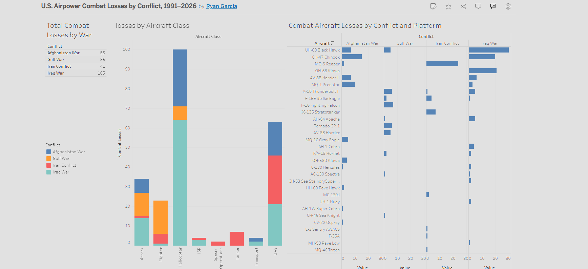

# U.S. Airpower Combat Losses, 1991–2026

## Dashboard Preview



## Project Summary

This project analyzes U.S. combat aircraft losses across four major conflicts between 1991 and 2026 using an original dataset compiled from open-source reporting and historical records.

The goal is to examine how combat aircraft losses varied across conflicts, aircraft platforms, and mission categories, providing a structured view of post-Cold War U.S. airpower attrition.

## Key Findings

- The Iraq War accounts for the largest number of recorded combat aircraft losses.
- Helicopters represent the largest category of combat losses across the conflicts examined.
- UAV losses become increasingly significant in modern conflicts.
- Aircraft loss patterns vary substantially by conflict and mission type.

## Research Question

How have U.S. combat aircraft losses varied across major post-Cold War conflicts, and which aircraft classes and platforms experienced the highest losses?

## Interactive Dashboard

[View Tableau Dashboard](https://public.tableau.com/app/profile/ryan.garcia4428/viz/U_S_AirpowerCombatLossesbyConflict19912026/Dashboard1)

## Conflicts Included

- Gulf War (1991)
- Afghanistan War (2001–2021)
- Iraq War (2003–2011)
- Iran Conflict (2024–2026)

## Dataset

The dataset categorizes losses by:

- Conflict
- Aircraft Platform
- Aircraft Class
- Combat Loss Count

Aircraft were grouped into the following classes:

- Attack
- Fighter
- Helicopter
- ISR
- Special Operations
- Tanker
- Transport
- UAV

## Repository Structure

```text
data/
docs/
images/
tableau/
README.md
```

## Methodology

Data was collected from publicly available reporting, official statements, and historical sources. Aircraft losses were reviewed and classified into standardized categories to support cross-conflict comparison and visualization.

Detailed methodology, source documentation, and analytical notes can be found in the `/docs` directory.

## Tools Used

- Microsoft Excel
- Tableau Public

## Limitations

- Results depend on publicly available reporting.
- Some incidents may remain disputed, classified, or unreported.
- Ongoing conflicts may result in future revisions to the dataset.
- Open-source reporting may vary in quality and completeness across conflicts.

## About

Independent researcher focused on conflict analysis, military affairs, security studies, and data-driven analysis of modern warfare.

## Contact

- LinkedIn: [Ryan Ross Garcia](https://www.linkedin.com/in/ryan-ross-garcia)
